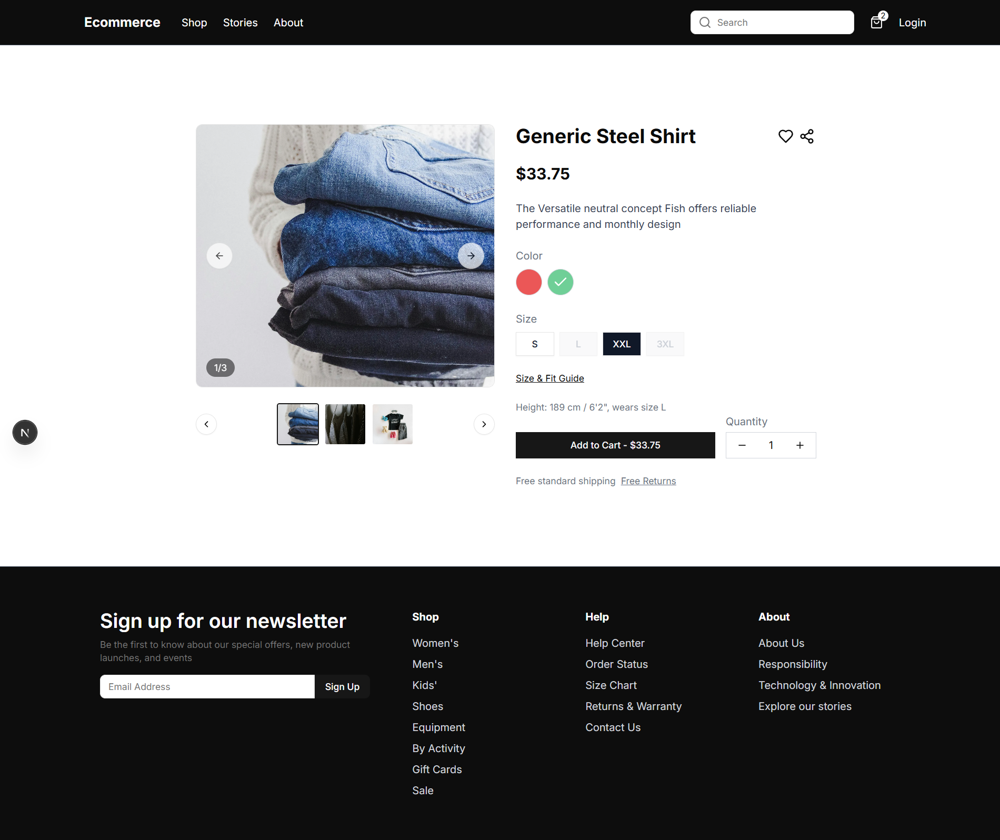

# HYBRBASE Technical Challenge Submission

## 👋 Introduction

Thank you for the opportunity to take on this technical challenge. Due to the time constraint, I chose to prioritize the **core user-facing flows** (Product Catalog, Product Detail, Cart & Checkout) rather than completing every feature. This allowed me to focus on building a professional, performant, and user-friendly foundation for the e-commerce application.

## ✅ Completed Use Cases

### 📦 Product Catalog

- **UC-1.1 View Product List**: Implemented pagination using "Show more" interaction for better performance.
- **UC-1.2 Filter Products by Category/Color**: Multi-filter support with persistent UI state.
- **UC-1.3 Sort Products**: Enabled sorting by popularity, ascending and descending price.
- **UC-1.4 Show Filtered Product Count**: Real-time product count updates on filter change.
- **UC-1.5 Search Product by Name**: Fuzzy name search implemented on the product list.

### 🛍️ Product Detail

- **UC-2.1 View Product Detail**: Rich product detail display including price, name, color, sizes, and styled model preview.
- **UC-2.2 View Product Images**: Responsive carousel with clickable thumbnails synced to main image.
- **UC-2.3 Like Product**: Toggle favorite status (planned persistence in future implementation).

### 🛒 Cart & Checkout

- **UC-3.1 to UC-3.10**: All checkout steps supported (cart display, shipping info, payment method, card details).
- Session-based cart management using `sessionId` stored in `localStorage`.
- Seamless merging of cart data when user logs in, ensuring continuity across devices.

## 🚀 Key Highlights

### 1. **Responsive & UX Focused Design**

- All pages are fully responsive for desktop, tablet, and mobile.
- Skeleton loading states enhance perceived performance.

### 2. **Convex Optimization**

- Convex has limitations with complex relational queries.
- I spent significant time optimizing these queries using `convex-helpers`, enabling combined filtering, full-text search, sorting, and cursor-based pagination across related tables (e.g., variants, colors, categories). This resulted in a smooth and scalable experience even with large datasets.

### 3. **SEO and Product Variants UX**

- Product detail pages use **SEO-friendly slugs** instead of raw product IDs.
- Smart variant filter: Based on available inventory, options are dynamically enabled/disabled (e.g., size M is disabled if not available for selected color).
- This reduces user error and improves confidence when selecting product configurations.

### 4. **Session-Based Shopping Cart (No Login Required)**

- Users can start shopping and checkout without an account.
- Session ID is persisted in `localStorage`.
- On login, cart and orders are intelligently merged with user profile.
- Enhances experience by removing the barrier to purchase.

## 🛠️ Technologies Used

- **Framework**: Next.js 15 with Turbopack
- **Database/Backend**: Convex
- **State/Forms**: React Hook Form, Zod, use-immer
- **UI/Styling**: TailwindCSS v4, Radix UI, clsx, class-variance-authority
- **UX Enhancements**: Embla Carousel, Skeleton Loaders, Sonner (Toasts)
- **Utilities**: lucide-react (Icons), use-debounce, nuqs (Query param sync), uuid
- **Testing/Dev Tools**: Faker.js, ESLint, Prettier, TypeScript 5

## 📸 Screenshots

| Page                    | Screenshot                                                       |
| ----------------------- | ---------------------------------------------------------------- |
| **Home (Landing Page)** |                            |
| **Shop (Product List)** |                            |
| **Product Detail**      |        |
| **Cart**                |                            |
| **Checkout – Address**  |    |
| **Checkout – Shipping** |  |
| **Checkout – Payment**  |    |

## 🔜 Features Planned But Not Implemented

- Authentication (email/social login)
- Review system (ratings, filters, feedback)
- Marketing sections (hero banners, newsletter subscription)

## 🤝 Final Notes

This project reflects my emphasis on **code quality**, **user experience**, and **problem-solving under constraints**. I’ve chosen depth over breadth to ensure a scalable and clean architecture, especially in handling data logic with Convex.

Please let me know if you'd like a walkthrough of the codebase or a live demo session.

Thanks again for this opportunity!

Best regards,  
**Tu**
